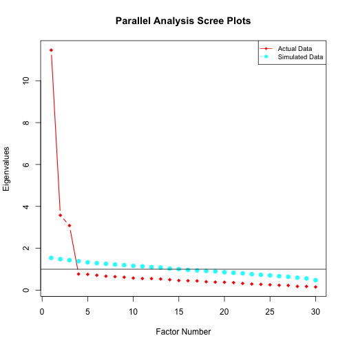

# Introduction
In this tutorial, we illustrate how to conduct multidimensional item response theory (MIRT) analysis of multidimensional two parameter logistic (M2PL) and multidimensional three parameter logistic (M3PL) models, and differential item functioning (DIF) analysis of M2PL models using the `VEMIRT` package in `R`, which can be installed with

``` r
devtools::install_github("MAP-LAB-UW/VEMIRT")
torch::install_torch()
```
The package requires a C++ compiler to work properly, and users are referred to https://github.com/MAP-LAB-UW/VEMIRT for more information.

``` r
library(VEMIRT)
```
Most functions are based on the Gaussian variational expectation-maximization (GVEM) algorithm, which is applicable for high-dimensional latent traits.


# Data Input
Data required for analysis are summarized below:

| Analysis | Item Responses | Loading Indicator | Group Membership |
| :-: | :-: | :-: | :-: |
| Exploratory Factor Analysis | $\checkmark$ |
| Confirmatory Factor Analysis | $\checkmark$ | $\checkmark$ |
| Differential Item Functioning | $\checkmark$ | $\checkmark$ | $\checkmark$ |

Here we take dataset `D2PL_data` as an example. This simulated dataset is for DIF 2PL analysis. 
Responses should be an $N$ by $J$ binary matrix, where $N$ and $J$ are the numbers of respondents and items respectively:

``` r
head(D2PL_data$data)
#>      [,1] [,2] [,3] [,4] [,5] [,6] [,7] [,8] [,9] [,10] [,11] [,12] [,13] [,14] [,15] [,16] [,17]
#> [1,]    1    1    1    1    1    1    1    1    1     1     1     1     1     1     1     1     0
#> [2,]    0    1    0    0    0    0    0    0    0     0     1     0     0     0     0     0     0
#> [3,]    1    1    1    1    1    1    1    1    1     1     1     1     1     0     1     1     1
#> [4,]    0    1    1    1    1    1    0    1    1     1     1     1     0     1     0     1     1
#> [5,]    0    1    1    1    1    1    0    1    1     1     1     1     1     1     0     1     1
#> [6,]    1    1    1    0    1    0    0    1    1     1     0     1     1     1     1     0     1
#>      [,18] [,19] [,20]
#> [1,]     1     1     1
#> [2,]     0     0     0
#> [3,]     1     1     1
#> [4,]     1     1     1
#> [5,]     1     0     0
#> [6,]     0     1     1
```

CFA relies on a $J$ by $D$ binary loading indicator matrix specifying latent dimensions each item loads on, where $D$ is the number of latent dimensions:

``` r
D2PL_data$model
#>       [,1] [,2]
#>  [1,]    1    0
#>  [2,]    0    1
#>  [3,]    1    0
#>  [4,]    0    1
#>  [5,]    1    0
#>  [6,]    0    1
#>  [7,]    1    0
#>  [8,]    0    1
#>  [9,]    1    0
#> [10,]    0    1
#> [11,]    1    0
#> [12,]    0    1
#> [13,]    1    0
#> [14,]    0    1
#> [15,]    1    0
#> [16,]    0    1
#> [17,]    1    0
#> [18,]    0    1
#> [19,]    1    0
#> [20,]    0    1
```

DIF analysis additionally needs an $N$ dimensional group membership vector, whose elements are integers from $1$ to $G$, where $G$ is the number of groups:

``` r
table(D2PL_data$group)
#> 
#>    1    2    3 
#> 1000 1000 1000
```


<!-- `VEMIRT` provides simulated data set `exampleDIF` as an example: -->
<!-- ```{r} -->
<!-- str(exampleDIF) -->
<!-- ``` -->
<!-- `Y` is an $N$ by $J$ binary response matrix, where $N$ and $J$ are the numbers of respondents and items respectively: -->
<!-- ```{r} -->
<!-- head(exampleDIF$Y) -->
<!-- ``` -->
<!-- `D` is a $J$ by $D$ binary loading indicator matrix specifying latent dimensions each item loads on, where $D$ is the number of latent dimensions: -->
<!-- ```{r} -->
<!-- exampleDIF$D -->
<!-- ``` -->
<!-- `X` is an $N$ dimensional vector of integers from $1$ to $G$, where $G$ is the number of groups: -->
<!-- ```{r} -->
<!-- table(exampleDIF$X) -->
<!-- ``` -->
<!-- The first `j` items of the data have DIF on both slopes and intercepts: -->
<!-- ```{r} -->
<!-- exampleDIF$j -->
<!-- with(exampleDIF$params, cbind(a[1, , ], a[2, , ], a[3, , ])) -->
<!-- exampleDIF$params$b -->
<!-- ``` -->
<!-- `params$theta` is the respondent latent traits: -->
<!-- ```{r} -->
<!-- head(exampleDIF$params$theta) -->
<!-- ``` -->
<!-- Only `Y`, `D` and `X` are needed for DIF analysis, while `j` and `params` are the parameters used for generating the item responses. -->


# Exploratory Factor Analysis
## Parallel Analysis
Parallel analysis can be conducted to determine the number of factors:

``` r
pa_poly(E2PL_data_C1$data, n.iter = 5)
```

```
#> Parallel analysis suggests that the number of factors =  6
```



## M2PL Model
`VEMIRT` provides the following functions to conduct EFA for the M2PL model:

| Function | Description |
| :-: | :-: |
| `E2PL_gvem_rot` | GVEM with post-doc rotation |
| `E2PL_gvem_lasso` | GVEM with lasso penalty |
| `E2PL_gvem_adaptlasso` | GVEM with adaptive lasso penalty |

Currently these functions do not estimate the standard errors of item parameters.

`E2PL_gvem_rot` needs the item responses and the number of factors (`domain`), and applies the promax rotation by default.

``` r
E2PL_gvem_rot(E2PL_data_C1$data, domain = 5)
#>                a1        a2       a3        a4        a5        b
#> Item 1   0.025817  1.413108  0.02121 -0.040209  0.024027  1.06393
#> Item 2   0.033953  1.694471  0.08156  0.067300 -0.041509  1.25230
#> Item 3  -0.018716  1.433046  0.06211  0.076723 -0.095585  2.14437
#> Item 4  -0.025096  1.277798  0.17077 -0.097352 -0.065946 -1.61450
#> Item 5   0.001469  1.534385  0.07229  0.025609  0.010630  1.29937
#> Item 6   0.012029  0.850006 -0.15704 -0.006764  0.056915 -3.46451
#> Item 7   0.055750  2.115562  0.02120 -0.025941 -0.051523  2.09872
#> Item 8   0.029551  1.460575 -0.03802  0.025566 -0.012917  1.25715
#> Item 9   0.009014  1.925015 -0.04641 -0.036101  0.123661 -0.80995
#> Item 10 -0.109747  1.986359  0.08174  0.006191 -0.074147  0.00951
#> Item 11  0.027260  1.673089 -0.04533 -0.036181  0.010355 -0.15948
#> Item 12  0.125815  1.828191  0.04132  0.101895 -0.086505 -0.43967
#> Item 13 -0.106343  1.929517 -0.01754  0.066820  0.109227 -0.58685
#> Item 14 -0.116409  1.621853  0.11027  0.012722  0.019466  0.41206
#> Item 15  0.016359  0.968937  0.04934 -0.063925 -0.018646 -2.71824
#> Item 16 -0.143375  0.017271 -0.01849  0.574231 -0.065354 -2.82058
#> Item 17 -0.066162  0.058251  0.01933  1.387586  0.118073 -0.44416
#> Item 18 -0.019221  0.000847  0.04007  1.291527  0.101510  0.28547
#> Item 19  0.065752 -0.003566  0.01651  1.290355  0.028761  1.50011
#> Item 20  0.000787  0.004552 -0.10442  1.500209  0.034881  1.10160
#> Item 21 -0.126867 -0.040595  0.09072  1.757112 -0.076626  0.39489
#> Item 22  0.111588  0.135732 -0.04375  2.002058 -0.050413  0.72867
#> Item 23 -0.022872 -0.040298  0.05908  1.693085 -0.038022 -1.23599
#> Item 24  0.024275  0.049997  0.01388  1.897630 -0.072306  0.86154
#> Item 25  0.073747 -0.014576 -0.07742  1.797380 -0.044598 -0.17101
#> Item 26  0.078650  0.003005 -0.14262  0.382983  0.066884 -4.69213
#> Item 27 -0.007831 -0.071031  0.05284  1.743336  0.019207 -1.41501
#> Item 28  0.065411  0.021060 -0.01056  0.726945 -0.000851  0.81968
#> Item 29 -0.040297 -0.040991  0.00392  1.331407  0.009543 -0.75065
#> Item 30  0.083171 -0.019887 -0.03562  1.338572  0.042641 -2.07908
#> Item 31 -0.020742 -0.011581  1.49604 -0.090649 -0.026927  1.13697
#> Item 32 -0.116829  0.020841  1.99625  0.034105  0.004068  0.36590
#> Item 33 -0.011715 -0.046954  1.50027 -0.035418  0.022696 -1.21066
#> Item 34  0.021692 -0.117613  1.04968  0.035653  0.024460 -2.47348
#> Item 35  0.075268 -0.030059  1.02665  0.074673 -0.010580 -2.41826
#> Item 36  0.107192 -0.028129  1.24712 -0.032710 -0.066312  1.18418
#> Item 37  0.012676  0.007861  0.82896  0.076090  0.104168  1.31404
#> Item 38 -0.027304 -0.086047  1.36551 -0.029833  0.049667  1.64983
#> Item 39 -0.072543 -0.028909  1.22562  0.013561 -0.055039  0.62966
#> Item 40  0.041243 -0.000498  1.13610  0.026266  0.099034  3.02173
#> Item 41 -0.066507  0.007349  2.16709 -0.068239  0.027550  1.38244
#> Item 42  0.102924  0.008609  2.23134 -0.005061 -0.095246  1.41196
#> Item 43  0.084628 -0.054440  1.45966  0.107223 -0.015335  0.74286
#> Item 44 -0.041821 -0.012737  1.34532 -0.048416  0.041745  0.64595
#> Item 45  0.017860  0.172559  2.23527  0.053705  0.086015  1.67871
#> Item 46 -0.039299 -0.016001 -0.07848  0.013482  1.240025 -0.26172
#> Item 47  0.069532 -0.049477  0.07304 -0.025412  1.372652  0.33693
#> Item 48  0.001628 -0.024606 -0.02852  0.047357  0.967062 -2.06172
#> Item 49 -0.058951 -0.017910  0.10328  0.105602  0.307158  3.95795
#> Item 50  0.008724  0.083336 -0.00807 -0.019139  0.872496  1.23215
#> Item 51  0.052456  0.078426 -0.02944 -0.043364  0.981121  2.15817
#> Item 52 -0.067991  0.013332 -0.05356 -0.045868  1.089071  0.06776
#> Item 53 -0.072847  0.014828 -0.04934 -0.092370  1.018962 -1.28590
#> Item 54 -0.017973  0.064153 -0.15305 -0.000195  1.275831 -1.16858
#> Item 55  0.061272 -0.019983 -0.04948 -0.149298  1.838806  0.59039
#> Item 56 -0.085531 -0.059343  0.08157 -0.096908  1.582136  0.11708
#> Item 57 -0.041666  0.041180  0.07586  0.004740  1.516003 -0.61568
#> Item 58  0.119910  0.016292  0.02241  0.014000  1.308270  0.77344
#> Item 59  0.120273 -0.003290  0.03216  0.087465  1.773973  0.29381
#> Item 60 -0.057350 -0.013764  0.01901  0.038946  1.507382  1.68614
#> Item 61  1.833181 -0.080982 -0.10382  0.077355  0.003370  0.95145
#> Item 62  1.471053  0.083946 -0.05619  0.087991 -0.049977  2.55508
#> Item 63  1.893051 -0.011005 -0.00430  0.050995 -0.041637  0.61393
#> Item 64  1.786112 -0.062372  0.10093 -0.117220  0.079261 -0.11561
#> Item 65  1.191517 -0.028128  0.07802 -0.111035  0.026599  0.29362
#> Item 66  1.139407 -0.000331  0.00347  0.074962 -0.120070  1.17200
#> Item 67  1.581807 -0.133574  0.03385 -0.004198  0.156121  0.08715
#> Item 68  2.254226  0.003160 -0.01055  0.092607 -0.029202  1.29483
#> Item 69  1.346315  0.015557 -0.06666  0.041091 -0.081834 -0.20448
#> Item 70  1.683151  0.019140  0.04140 -0.042044  0.115003  0.76454
#> Item 71  1.544739  0.107192  0.03602 -0.052967 -0.064920  0.80910
#> Item 72  1.415834 -0.025510 -0.02612  0.061141  0.008900  2.28028
#> Item 73  1.850935 -0.054654 -0.08948  0.079705  0.042284  3.48455
#> Item 74  2.072928  0.054302  0.06335 -0.083024  0.061608 -0.61781
#> Item 75  1.229275  0.125550 -0.00568 -0.110895  0.005689 -0.17688
```

Both `E2PL_gvem_lasso` and `E2PL_gvem_adaptlasso` need item responses, constraint setting (`constrain`), and a binary matrix specifying constraints on the sub-matrix of the factor loading structure (`indic`). `constrain` should be either `"C1"` or `"C2"` to ensure identifiability. Under `"C1"`, a $D\times D$ sub-matrix of `indic` should be an identity matrix, indicating that each of these $D$ items loads solely on one factor. Under `"C2"`, a $D\times D$ sub-matrix of `indic` should be a lower triangular matrix whose diagonal elements are all one, indicating that each of these $D$ items loads on one factor and potentially other factors as well; non-zero elements other than the diagonal are penalized. For identification under `"C2"`, another argument `non_pen` should be provided, which specifies an anchor item that loads on all the factors. `E2PL_gvem_adaptlasso` needs an additional tuning parameter `gamma`.

``` r
with(E2PL_data_C1, E2PL_gvem_adaptlasso(data, model, constrain = "C1", gamma = 2))
#>            a1    a2    a3    a4      a5        b
#> Item 1  1.408 0.000 0.000 0.000  0.0000  1.06213
#> Item 2  1.711 0.000 0.000 0.000  0.0000  1.25013
#> Item 3  1.434 0.000 0.000 0.000  0.0000  2.13681
#> Item 4  1.266 0.000 0.000 0.000  0.0000 -1.60460
#> Item 5  1.547 0.000 0.000 0.000  0.0000  1.29866
#> Item 6  0.836 0.000 0.000 0.000  0.0000 -3.45109
#> Item 7  2.108 0.000 0.000 0.000  0.0000  2.09482
#> Item 8  1.461 0.000 0.000 0.000  0.0000  1.25673
#> Item 9  1.908 0.000 0.000 0.000  0.0000 -0.80453
#> Item 10 1.968 0.000 0.000 0.000  0.0000  0.00805
#> Item 11 1.655 0.000 0.000 0.000  0.0000 -0.15870
#> Item 12 1.836 0.000 0.000 0.000  0.0000 -0.43683
#> Item 13 1.925 0.000 0.000 0.000  0.0000 -0.58386
#> Item 14 1.618 0.000 0.000 0.000  0.0000  0.40971
#> Item 15 0.959 0.000 0.000 0.000  0.0000 -2.71282
#> Item 16 0.000 0.557 0.000 0.000  0.0000 -2.81123
#> Item 17 0.000 1.393 0.000 0.136  0.0000 -0.44394
#> Item 18 0.000 1.297 0.000 0.118  0.0000  0.28545
#> Item 19 0.000 1.293 0.000 0.000  0.0826  1.49962
#> Item 20 0.000 1.480 0.000 0.000  0.0000  1.09685
#> Item 21 0.000 1.744 0.000 0.000 -0.1118  0.39204
#> Item 22 0.000 2.004 0.000 0.000  0.1235  0.72528
#> Item 23 0.000 1.682 0.000 0.000  0.0000 -1.23321
#> Item 24 0.000 1.894 0.000 0.000  0.0000  0.85788
#> Item 25 0.000 1.774 0.000 0.000  0.0714 -0.17123
#> Item 26 0.000 0.375 0.000 0.000  0.0000 -4.67421
#> Item 27 0.000 1.733 0.000 0.000  0.0000 -1.41157
#> Item 28 0.000 0.735 0.000 0.000  0.0000  0.81866
#> Item 29 0.000 1.320 0.000 0.000  0.0000 -0.75004
#> Item 30 0.000 1.330 0.000 0.000  0.1008 -2.07654
#> Item 31 0.000 0.000 1.467 0.000  0.0000  1.13245
#> Item 32 0.000 0.000 1.972 0.000  0.0000  0.36651
#> Item 33 0.000 0.000 1.494 0.000  0.0000 -1.21068
#> Item 34 0.000 0.000 1.040 0.000  0.0000 -2.46267
#> Item 35 0.000 0.000 1.056 0.000  0.0000 -2.42242
#> Item 36 0.000 0.000 1.240 0.000  0.0000  1.17966
#> Item 37 0.000 0.000 0.856 0.000  0.0000  1.30937
#> Item 38 0.000 0.000 1.349 0.000  0.0000  1.64415
#> Item 39 0.000 0.000 1.204 0.000  0.0000  0.62979
#> Item 40 0.000 0.000 1.159 0.000  0.0000  3.01565
#> Item 41 0.000 0.000 2.149 0.000  0.0000  1.38008
#> Item 42 0.000 0.000 2.221 0.000  0.0000  1.40611
#> Item 43 0.000 0.000 1.475 0.000  0.0000  0.74114
#> Item 44 0.000 0.000 1.340 0.000  0.0000  0.64577
#> Item 45 0.000 0.000 2.248 0.000  0.0000  1.66145
#> Item 46 0.000 0.000 0.000 1.217  0.0000 -0.26259
#> Item 47 0.000 0.000 0.000 1.385  0.0000  0.33679
#> Item 48 0.000 0.000 0.000 0.966  0.0000 -2.06081
#> Item 49 0.000 0.000 0.000 0.314  0.0000  3.94227
#> Item 50 0.000 0.000 0.000 0.877  0.0000  1.23030
#> Item 51 0.000 0.000 0.000 0.981  0.0000  2.15184
#> Item 52 0.000 0.000 0.000 1.066  0.0000  0.06649
#> Item 53 0.000 0.000 0.000 0.990  0.0000 -1.28164
#> Item 54 0.000 0.000 0.000 1.253  0.0000 -1.16598
#> Item 55 0.000 0.000 0.000 1.807  0.0000  0.58592
#> Item 56 0.000 0.000 0.000 1.555  0.0000  0.11558
#> Item 57 0.000 0.000 0.000 1.523  0.0000 -0.61452
#> Item 58 0.000 0.000 0.000 1.327  0.0000  0.77148
#> Item 59 0.000 0.000 0.000 1.789  0.0000  0.29194
#> Item 60 0.000 0.000 0.000 1.497  0.0000  1.68001
#> Item 61 0.000 0.000 0.000 0.000  1.8111  0.94754
#> Item 62 0.000 0.000 0.000 0.000  1.4658  2.54375
#> Item 63 0.000 0.000 0.000 0.000  1.8802  0.61130
#> Item 64 0.000 0.000 0.000 0.000  1.7840 -0.11556
#> Item 65 0.000 0.000 0.000 0.000  1.1882  0.29230
#> Item 66 0.000 0.000 0.000 0.000  1.1200  1.16490
#> Item 67 0.000 0.000 0.000 0.000  1.5820  0.08630
#> Item 68 0.000 0.000 0.000 0.000  2.2511  1.29091
#> Item 69 0.000 0.000 0.000 0.000  1.3207 -0.20344
#> Item 70 0.000 0.000 0.000 0.000  1.6983  0.76212
#> Item 71 0.000 0.000 0.000 0.000  1.5409  0.80602
#> Item 72 0.000 0.000 0.000 0.000  1.4155  2.27801
#> Item 73 0.000 0.000 0.000 0.000  1.8428  3.47621
#> Item 74 0.000 0.000 0.000 0.000  2.0908 -0.61892
#> Item 75 0.000 0.000 0.000 0.000  1.2259 -0.17629
with(E2PL_data_C2, E2PL_gvem_lasso(data, model, constrain = "C2", non_pen = 61))
#> Warning: The maximum number of EM cycles reached!
#> Warning: The maximum number of EM cycles reached!
#> Warning: The maximum number of EM cycles reached!
#> Warning: The maximum number of EM cycles reached!
#> Warning: The maximum number of EM cycles reached!
#> Warning: The maximum number of EM cycles reached!
#> Warning: The maximum number of EM cycles reached!
#> Warning: The maximum number of EM cycles reached!
#>               a1      a2      a3       a4      a5        b
#> Item 1   1.41384  0.0000  0.0000  0.00000  0.0000  1.06365
#> Item 2   1.68771  0.3312  0.4252 -0.17326  0.3814  1.25215
#> Item 3   1.42732  0.2429 -0.0247 -0.33213  0.1682  2.14429
#> Item 4   1.27376  0.8763  0.6420 -0.22851 -0.0526 -1.61455
#> Item 5   1.52858  0.2867  0.4048 -0.00874  0.2077  1.29935
#> Item 6   0.83637 -0.2964  0.0000  0.29088  0.0000 -3.45689
#> Item 7   2.10621 -0.0387  0.1282 -0.22025  0.4048  2.09835
#> Item 8   1.45383 -0.3322 -0.1658 -0.08455  0.3030  1.25714
#> Item 9   1.91632 -0.4152  0.1006  0.32117  0.2285 -0.80987
#> Item 10  1.97359  0.2760 -0.0832 -0.29296  0.0000  0.00931
#> Item 11  1.66209 -0.2860  0.0000  0.00000  0.2866 -0.15944
#> Item 12  1.82205  0.0000  0.3319 -0.30853  0.7693 -0.43973
#> Item 13  1.92146 -0.2562 -0.1953  0.27962 -0.0735 -0.58682
#> Item 14  1.61618  0.4970  0.2168  0.01917 -0.2137  0.41212
#> Item 15  0.96942  0.0351  0.0000 -0.11552  0.0444 -2.71743
#> Item 16  0.00575  0.5585  0.0000  0.00000  0.0000 -2.81205
#> Item 17  0.06013  0.0000  0.2132  0.36954  1.2627 -0.44417
#> Item 18  0.00000  0.1891  0.5004  0.31547  1.3157  0.28553
#> Item 19  0.00000  0.0563  0.4624  0.08959  1.6085  1.50022
#> Item 20  0.00460 -0.6319 -0.4113  0.10333  1.6025  1.10169
#> Item 21 -0.03842  0.4795 -0.0989 -0.22545  1.4036  0.39493
#> Item 22  0.13617 -0.3056  0.0991 -0.15922  2.5375  0.72875
#> Item 23 -0.03884  0.3028  0.2173 -0.10849  1.7130 -1.23597
#> Item 24  0.05181  0.0000  0.0000 -0.22386  2.1016  0.86176
#> Item 25 -0.01419 -0.4756 -0.2089 -0.13736  2.1671 -0.17091
#> Item 26  0.00000 -0.8128 -0.2952  0.20038  0.6844 -4.69119
#> Item 27 -0.06877  0.2604  0.3924  0.06662  1.8159 -1.41496
#> Item 28  0.02138 -0.0806  0.2066  0.00000  1.0068  0.81968
#> Item 29 -0.03865  0.0000 -0.0613  0.00000  1.2685 -0.75056
#> Item 30 -0.01942 -0.2276  0.2921  0.13331  1.7190 -2.07873
#> Item 31 -0.00380  8.4170  8.2395  0.00000  0.0000  1.13677
#> Item 32  0.03987 11.2826 10.6005  0.10843 -0.3926  0.36587
#> Item 33 -0.03399  8.4647  8.3593  0.13442  0.0000 -1.21005
#> Item 34 -0.10682  5.9458  5.9494  0.12909  0.0991 -2.47335
#> Item 35 -0.01970  5.7962  5.8923  0.00000  0.3458 -2.41637
#> Item 36 -0.00720  7.1311  6.8628 -0.11065  0.0000  1.18229
#> Item 37  0.01594  4.6847  4.9241  0.35916  0.1276  1.31414
#> Item 38 -0.07265  7.7267  7.5743  0.22015 -0.1480  1.64940
#> Item 39 -0.01750  6.9447  6.3545 -0.10757 -0.2600  0.62987
#> Item 40  0.01066  6.4190  6.6958  0.35788  0.1681  3.02080
#> Item 41  0.02803 12.2677 11.7970  0.19171 -0.3338  1.38309
#> Item 42  0.02958 12.6169 12.3999 -0.18707  0.3351  1.41091
#> Item 43 -0.03959  8.2656  8.3086  0.00000  0.3992  0.74267
#> Item 44  0.00000  7.6063  7.3881  0.19254 -0.2073  0.64583
#> Item 45  0.19316 12.6194 12.6358  0.36566  0.1259  1.67794
#> Item 46 -0.01477 -0.5164  2.9912  3.79602  0.0000 -0.26172
#> Item 47 -0.04563  0.3368  4.5711  4.20964  0.3243  0.33687
#> Item 48 -0.02277 -0.2132  2.6144  2.96307  0.1294 -2.06151
#> Item 49  0.00000  0.5640  1.2286  0.94543 -0.0847  3.95811
#> Item 50  0.08463 -0.1007  2.4772  2.67113  0.0895  1.23208
#> Item 51  0.07978 -0.2324  2.8222  3.00101  0.2311  2.15772
#> Item 52  0.01462 -0.3631  2.5755  3.33588 -0.1967  0.06777
#> Item 53  0.01619 -0.3332  2.3771  3.12258 -0.2735 -1.28604
#> Item 54  0.06620 -0.9307  2.7060  3.90522  0.0000 -1.16843
#> Item 55 -0.01669 -0.3803  5.1974  5.63177  0.2092  0.59027
#> Item 56 -0.05530  0.3829  4.6672  4.85852 -0.2874  0.11712
#> Item 57  0.04418  0.3402  4.6182  4.65024  0.0000 -0.61576
#> Item 58  0.01902  0.0529  4.3001  4.00948  0.5517  0.77347
#> Item 59  0.00000  0.0790  5.6896  5.43676  0.6699  0.29382
#> Item 60 -0.01007  0.0000  4.1914  4.62602 -0.0415  1.68644
#> Item 61 -0.08366 -0.5639  6.1031  0.00000  6.6206  0.95171
#> Item 62  0.08222 -0.3061  4.8783 -0.17631  5.3453  2.55388
#> Item 63 -0.01271  0.0000  6.7273 -0.14936  6.8088  0.61398
#> Item 64 -0.06256  0.6013  7.2609  0.22932  6.2462 -0.11544
#> Item 65 -0.02841  0.4628  4.8279  0.07286  4.1329  0.29364
#> Item 66  0.00000  0.0000  3.7810 -0.37959  4.1431  1.17224
#> Item 67 -0.13395  0.2174  6.3789  0.46581  5.6400  0.08724
#> Item 68  0.00000  0.0000  8.0686 -0.11651  8.1407  1.29466
#> Item 69  0.01357 -0.3563  4.2841 -0.26955  4.8435 -0.20441
#> Item 70  0.01848  0.2445  6.6568  0.33303  5.9759  0.76454
#> Item 71  0.10560  0.2209  5.6147 -0.21848  5.4656  0.80914
#> Item 72 -0.02671 -0.1266  5.0210  0.00000  5.1242  2.28143
#> Item 73 -0.05655 -0.4766  6.3595  0.10645  6.6964  3.48657
#> Item 74  0.05288  0.3784  8.0447  0.16526  7.3269 -0.61787
#> Item 75  0.12358  0.0000  4.4585  0.00000  4.2817 -0.17681
```

## M3PL Model
`VEMIRT` provides the following functions to conduct EFA for the M3PL model:

| Function | Description |
| :-: | :-: |
| `E3PL_sgvem_rot` | Stochastic GVEM with post-doc rotation |
| `E3PL_sgvem_lasso` | Stochastic GVEM with lasso penalty |
| `E3PL_sgvem_adaptlasso` | Stochastic GVEM with adaptive lasso penalty |

The usage of these functions is similar to those for M2PL models, but some additional arguments are required: the size of the subsample for each iteration (`samp`), the forget rate for the stochastic algorithm (`forgetrate`), the mean and the variance of the prior distribution of item difficulty parameters (`mu_b` and `sigma2_b`), the $\alpha$ and $\beta$ parameters of the prior distribution of guessing parameters (`Alpha` and `Beta`).

``` r
with(E3PL_data_C1, E3PL_sgvem_lasso(data, model, samp = 50, forgetrate = 0.51, mu_b = 0, sigma2_b = 4, Alpha = 10, Beta = 40, constrain = "C1"))
#> Warning: The maximum number of EM cycles reached!
#>             a1    a2    a3       b
#> Item 1  0.9523 0.000 0.000  0.4538
#> Item 2  1.5384 0.000 0.000  0.1208
#> Item 3  1.0860 0.000 0.000 -0.2533
#> Item 4  1.5426 0.000 0.000 -0.5434
#> Item 5  1.5340 0.000 0.000 -0.6115
#> Item 6  0.6916 0.000 0.000 -0.7404
#> Item 7  1.1416 0.000 0.000 -0.4010
#> Item 8  1.5001 0.000 0.000 -1.3173
#> Item 9  0.8763 0.000 0.000  1.4608
#> Item 10 0.1492 0.811 0.000  0.8662
#> Item 11 0.0000 1.186 0.000 -1.0222
#> Item 12 0.0000 1.042 0.000 -0.4302
#> Item 13 0.0000 1.137 0.000 -0.5201
#> Item 14 0.0000 0.672 0.000  0.6607
#> Item 15 0.3369 0.742 0.000 -0.1044
#> Item 16 0.0000 1.234 0.000  0.1673
#> Item 17 0.0000 1.090 0.000 -0.0713
#> Item 18 0.0000 1.044 0.000 -0.1526
#> Item 19 0.0000 0.000 0.865  0.8830
#> Item 20 0.0000 0.000 0.878 -0.2281
#> Item 21 0.0000 0.000 1.101  0.8168
#> Item 22 0.0000 0.000 0.573 -1.5960
#> Item 23 0.1510 0.000 1.015  0.2297
#> Item 24 0.0000 0.000 1.239 -0.1925
#> Item 25 0.0000 0.000 0.690  0.1744
#> Item 26 0.1576 0.177 0.906  0.2487
#> Item 27 0.0216 0.000 0.974 -0.6024
#> Item 28 0.9068 1.052 0.000 -0.3644
#> Item 29 1.3590 0.597 0.000 -0.9737
#> Item 30 1.0089 1.018 0.000 -0.9393
#> Item 31 0.9521 0.987 0.000  0.2034
#> Item 32 1.0304 0.000 0.605  0.0750
#> Item 33 0.7111 0.000 1.153 -0.2056
#> Item 34 1.4253 0.000 1.160  0.2704
#> Item 35 0.7105 0.000 0.736  1.3208
#> Item 36 0.0345 0.656 1.239 -0.4630
#> Item 37 0.1932 0.716 0.806 -1.8906
#> Item 38 0.0923 0.595 0.964  0.5812
#> Item 39 0.6656 0.680 0.806 -0.7628
#> Item 40 0.8251 0.763 1.105 -0.7812
#> Item 41 1.3122 0.706 0.870  0.4147
#> Item 42 1.2151 0.585 1.018 -0.4815
#> Item 43 1.1353 0.640 1.298 -1.0594
#> Item 44 1.1375 0.657 1.121 -0.1925
#> Item 45 1.3470 0.626 1.104 -0.3188
with(E3PL_data_C2, E3PL_sgvem_adaptlasso(data, model, mu_b = 0, sigma2_b = 4, Alpha = 10, Beta = 40, constrain = "C2", non_pen = 19, gamma = 2))
#> Warning: The maximum number of EM cycles reached!
#> Warning: The maximum number of EM cycles reached!
#> Warning: The maximum number of EM cycles reached!
#>              a1      a2       a3       b
#> Item 1   0.2570  0.0000  0.00000  0.4511
#> Item 2   0.0000  1.4218  0.13413  0.1851
#> Item 3   0.0000  1.0868 -0.06906 -0.2057
#> Item 4   0.0000  1.4898  0.04812 -0.4763
#> Item 5  -0.0342  1.3932  0.21493 -0.5415
#> Item 6   0.0000  0.7061  0.00000 -0.7292
#> Item 7   0.0000  1.0989 -0.07912 -0.3626
#> Item 8   0.0000  1.4549 -0.00639 -1.2656
#> Item 9   0.0000  0.8057  0.00000  1.4669
#> Item 10  0.0000  0.4274  0.00000  0.8505
#> Item 11  1.0863 -0.1252  0.00000 -0.9753
#> Item 12  0.9753 -0.0594  0.00000 -0.4003
#> Item 13  1.0777 -0.2274  0.00000 -0.5327
#> Item 14  0.0000  0.2233  0.00000  0.6501
#> Item 15  0.0000  0.6411  0.00000 -0.1181
#> Item 16  1.1116 -0.1351  0.00000  0.1693
#> Item 17  1.0109 -0.2260  0.00000 -0.0593
#> Item 18  0.9603 -0.0327  0.00000 -0.1238
#> Item 19  0.0000  0.0000  0.83651  0.9038
#> Item 20  0.0000  0.0000  0.89610 -0.2039
#> Item 21  0.0000  0.0000  1.09523  0.8406
#> Item 22  0.0000  0.0000  0.59659 -1.5781
#> Item 23  0.1456  0.0000  1.03962  0.2603
#> Item 24  0.0000  0.0000  1.26132 -0.1728
#> Item 25  0.0000  0.0000  0.69521  0.1887
#> Item 26  0.2113  0.0000  0.95741  0.2892
#> Item 27  0.0000  0.0000  0.97780 -0.5540
#> Item 28  0.9145  0.7349  0.10399 -0.3352
#> Item 29  0.4783  1.2509 -0.00269 -0.9363
#> Item 30  0.8897  0.8425  0.00000 -0.9361
#> Item 31  0.8344  0.8221  0.07978  0.3021
#> Item 32 -0.0716  0.9941  0.62993  0.1135
#> Item 33 -0.0167  0.5832  1.22767 -0.1831
#> Item 34 -0.0527  1.3033  1.23073  0.3181
#> Item 35  0.2285  0.0000  0.82441  1.2861
#> Item 36  0.5957  0.0000  1.23542 -0.4263
#> Item 37  0.7106  0.0000  0.86787 -1.8671
#> Item 38  0.5567  0.0000  1.00998  0.6277
#> Item 39  0.6297  0.5195  0.87330 -0.7158
#> Item 40  0.7148  0.6428  1.17453 -0.7149
#> Item 41  0.6351  1.1055  0.95996  0.4572
#> Item 42  0.4936  1.0608  1.05774 -0.4115
#> Item 43  0.5854  0.9030  1.40380 -1.0181
#> Item 44  0.5599  0.9869  1.17264 -0.1533
#> Item 45  0.5014  1.1999  1.18127 -0.2710
```


# Confirmatory Factor Analysis
## M2PL Model
`VEMIRT` provides the following functions to conduct CFA for the M2PL model:

| Function | Description |
| :-: | :-: |
| `C2PL_gvem` | GVEM |
| `C2PL_bs` | GVEM with bootstrap |
| `C2PL_iw` | GVEM with importance sampling |

A binary loading indicator matrix needs to be provided for CFA. `C2PL_gvem` can produce biased estimates while the other two functions help reduce the bias. Also, only `C2PL_gvem` and `C2PL_bs` are able to provide the standard errors of item parameters.

``` r
result <- with(C2PL_data, C2PL_gvem(data, model))
C2PL_bs(result)
#>           a1    a2    a3    a4   a5       b
#> Item 1  1.51 0.000 0.000 0.000 0.00  1.0836
#> Item 2  1.93 0.000 0.000 0.000 0.00  1.3545
#> Item 3  1.63 0.000 0.000 0.000 0.00  2.2803
#> Item 4  1.37 0.000 0.000 0.000 0.00 -1.6125
#> Item 5  1.65 0.000 0.000 0.000 0.00  1.3411
#> Item 6  1.02 0.000 0.000 0.000 0.00 -3.4919
#> Item 7  2.48 0.000 0.000 0.000 0.00  2.3165
#> Item 8  1.61 0.000 0.000 0.000 0.00  1.3279
#> Item 9  2.14 0.000 0.000 0.000 0.00 -0.7991
#> Item 10 2.24 0.000 0.000 0.000 0.00  0.0883
#> Item 11 1.77 0.000 0.000 0.000 0.00 -0.1098
#> Item 12 2.09 0.000 0.000 0.000 0.00 -0.4563
#> Item 13 2.17 0.000 0.000 0.000 0.00 -0.5709
#> Item 14 1.79 0.000 0.000 0.000 0.00  0.4716
#> Item 15 1.09 0.000 0.000 0.000 0.00 -2.7882
#> Item 16 0.00 0.694 0.000 0.000 0.00 -2.8560
#> Item 17 0.00 1.498 0.000 0.000 0.00 -0.4553
#> Item 18 0.00 1.398 0.000 0.000 0.00  0.3226
#> Item 19 0.00 1.398 0.000 0.000 0.00  1.5779
#> Item 20 0.00 1.677 0.000 0.000 0.00  1.1884
#> Item 21 0.00 1.932 0.000 0.000 0.00  0.4158
#> Item 22 0.00 2.327 0.000 0.000 0.00  0.7819
#> Item 23 0.00 1.935 0.000 0.000 0.00 -1.3257
#> Item 24 0.00 2.200 0.000 0.000 0.00  0.9275
#> Item 25 0.00 2.028 0.000 0.000 0.00 -0.2046
#> Item 26 0.00 0.644 0.000 0.000 0.00 -4.6844
#> Item 27 0.00 1.951 0.000 0.000 0.00 -1.4950
#> Item 28 0.00 0.751 0.000 0.000 0.00  0.8429
#> Item 29 0.00 1.495 0.000 0.000 0.00 -0.7804
#> Item 30 0.00 1.517 0.000 0.000 0.00 -2.1451
#> Item 31 0.00 0.000 1.620 0.000 0.00  1.1944
#> Item 32 0.00 0.000 2.267 0.000 0.00  0.4252
#> Item 33 0.00 0.000 1.558 0.000 0.00 -1.2298
#> Item 34 0.00 0.000 1.092 0.000 0.00 -2.5319
#> Item 35 0.00 0.000 1.113 0.000 0.00 -2.4847
#> Item 36 0.00 0.000 1.384 0.000 0.00  1.2675
#> Item 37 0.00 0.000 0.871 0.000 0.00  1.3390
#> Item 38 0.00 0.000 1.498 0.000 0.00  1.7055
#> Item 39 0.00 0.000 1.202 0.000 0.00  0.6200
#> Item 40 0.00 0.000 1.424 0.000 0.00  3.2170
#> Item 41 0.00 0.000 2.560 0.000 0.00  1.4931
#> Item 42 0.00 0.000 2.705 0.000 0.00  1.5867
#> Item 43 0.00 0.000 1.619 0.000 0.00  0.7860
#> Item 44 0.00 0.000 1.474 0.000 0.00  0.6623
#> Item 45 0.00 0.000 2.781 0.000 0.00  1.8574
#> Item 46 0.00 0.000 0.000 1.301 0.00 -0.2557
#> Item 47 0.00 0.000 0.000 1.503 0.00  0.4036
#> Item 48 0.00 0.000 0.000 1.105 0.00 -2.1435
#> Item 49 0.00 0.000 0.000 0.425 0.00  4.0348
#> Item 50 0.00 0.000 0.000 0.934 0.00  1.2350
#> Item 51 0.00 0.000 0.000 1.152 0.00  2.2981
#> Item 52 0.00 0.000 0.000 1.117 0.00  0.0652
#> Item 53 0.00 0.000 0.000 0.983 0.00 -1.2838
#> Item 54 0.00 0.000 0.000 1.325 0.00 -1.1698
#> Item 55 0.00 0.000 0.000 2.106 0.00  0.6729
#> Item 56 0.00 0.000 0.000 1.713 0.00  0.1472
#> Item 57 0.00 0.000 0.000 1.677 0.00 -0.5924
#> Item 58 0.00 0.000 0.000 1.464 0.00  0.8655
#> Item 59 0.00 0.000 0.000 2.045 0.00  0.3747
#> Item 60 0.00 0.000 0.000 1.711 0.00  1.8850
#> Item 61 0.00 0.000 0.000 0.000 2.08  1.0643
#> Item 62 0.00 0.000 0.000 0.000 1.61  2.6786
#> Item 63 0.00 0.000 0.000 0.000 2.15  0.6861
#> Item 64 0.00 0.000 0.000 0.000 1.99 -0.1521
#> Item 65 0.00 0.000 0.000 0.000 1.25  0.3301
#> Item 66 0.00 0.000 0.000 0.000 1.21  1.2183
#> Item 67 0.00 0.000 0.000 0.000 1.73  0.1380
#> Item 68 0.00 0.000 0.000 0.000 2.70  1.4448
#> Item 69 0.00 0.000 0.000 0.000 1.40 -0.2342
#> Item 70 0.00 0.000 0.000 0.000 1.91  0.8339
#> Item 71 0.00 0.000 0.000 0.000 1.67  0.8643
#> Item 72 0.00 0.000 0.000 0.000 1.66  2.4529
#> Item 73 0.00 0.000 0.000 0.000 2.28  3.8643
#> Item 74 0.00 0.000 0.000 0.000 2.38 -0.6152
#> Item 75 0.00 0.000 0.000 0.000 1.24 -0.1285
C2PL_iw(C2PL_data$data, result)
#>            a1    a2    a3    a4   a5        b
#> Item 1  1.408 0.000 0.000 0.000 0.00  1.06213
#> Item 2  1.711 0.000 0.000 0.000 0.00  1.25012
#> Item 3  1.434 0.000 0.000 0.000 0.00  2.13680
#> Item 4  1.266 0.000 0.000 0.000 0.00 -1.60459
#> Item 5  1.547 0.000 0.000 0.000 0.00  1.29866
#> Item 6  0.836 0.000 0.000 0.000 0.00 -3.45115
#> Item 7  2.109 0.000 0.000 0.000 0.00  2.09484
#> Item 8  1.461 0.000 0.000 0.000 0.00  1.25671
#> Item 9  1.908 0.000 0.000 0.000 0.00 -0.80454
#> Item 10 1.968 0.000 0.000 0.000 0.00  0.00804
#> Item 11 1.655 0.000 0.000 0.000 0.00 -0.15870
#> Item 12 1.836 0.000 0.000 0.000 0.00 -0.43683
#> Item 13 1.925 0.000 0.000 0.000 0.00 -0.58387
#> Item 14 1.618 0.000 0.000 0.000 0.00  0.40971
#> Item 15 0.959 0.000 0.000 0.000 0.00 -2.71279
#> Item 16 0.000 0.554 0.000 0.000 0.00 -2.80984
#> Item 17 0.000 1.399 0.000 0.000 0.00 -0.44231
#> Item 18 0.000 1.305 0.000 0.000 0.00  0.28537
#> Item 19 0.000 1.301 0.000 0.000 0.00  1.49858
#> Item 20 0.000 1.480 0.000 0.000 0.00  1.09689
#> Item 21 0.000 1.724 0.000 0.000 0.00  0.39082
#> Item 22 0.000 2.011 0.000 0.000 0.00  0.72272
#> Item 23 0.000 1.680 0.000 0.000 0.00 -1.23241
#> Item 24 0.000 1.894 0.000 0.000 0.00  0.85747
#> Item 25 0.000 1.779 0.000 0.000 0.00 -0.17147
#> Item 26 0.000 0.377 0.000 0.000 0.00 -4.67489
#> Item 27 0.000 1.733 0.000 0.000 0.00 -1.41148
#> Item 28 0.000 0.736 0.000 0.000 0.00  0.81882
#> Item 29 0.000 1.318 0.000 0.000 0.00 -0.74967
#> Item 30 0.000 1.340 0.000 0.000 0.00 -2.07472
#> Item 31 0.000 0.000 1.467 0.000 0.00  1.13246
#> Item 32 0.000 0.000 1.972 0.000 0.00  0.36651
#> Item 33 0.000 0.000 1.494 0.000 0.00 -1.21063
#> Item 34 0.000 0.000 1.040 0.000 0.00 -2.46269
#> Item 35 0.000 0.000 1.056 0.000 0.00 -2.42248
#> Item 36 0.000 0.000 1.240 0.000 0.00  1.17967
#> Item 37 0.000 0.000 0.856 0.000 0.00  1.30935
#> Item 38 0.000 0.000 1.349 0.000 0.00  1.64414
#> Item 39 0.000 0.000 1.203 0.000 0.00  0.62979
#> Item 40 0.000 0.000 1.159 0.000 0.00  3.01558
#> Item 41 0.000 0.000 2.149 0.000 0.00  1.38007
#> Item 42 0.000 0.000 2.221 0.000 0.00  1.40612
#> Item 43 0.000 0.000 1.475 0.000 0.00  0.74117
#> Item 44 0.000 0.000 1.340 0.000 0.00  0.64577
#> Item 45 0.000 0.000 2.248 0.000 0.00  1.66145
#> Item 46 0.000 0.000 0.000 1.219 0.00 -0.26266
#> Item 47 0.000 0.000 0.000 1.386 0.00  0.33711
#> Item 48 0.000 0.000 0.000 0.965 0.00 -2.06039
#> Item 49 0.000 0.000 0.000 0.317 0.00  3.94327
#> Item 50 0.000 0.000 0.000 0.878 0.00  1.23055
#> Item 51 0.000 0.000 0.000 0.982 0.00  2.15226
#> Item 52 0.000 0.000 0.000 1.066 0.00  0.06660
#> Item 53 0.000 0.000 0.000 0.991 0.00 -1.28200
#> Item 54 0.000 0.000 0.000 1.256 0.00 -1.16687
#> Item 55 0.000 0.000 0.000 1.807 0.00  0.58607
#> Item 56 0.000 0.000 0.000 1.553 0.00  0.11576
#> Item 57 0.000 0.000 0.000 1.518 0.00 -0.61330
#> Item 58 0.000 0.000 0.000 1.326 0.00  0.77129
#> Item 59 0.000 0.000 0.000 1.788 0.00  0.29217
#> Item 60 0.000 0.000 0.000 1.498 0.00  1.68089
#> Item 61 0.000 0.000 0.000 0.000 1.81  0.94786
#> Item 62 0.000 0.000 0.000 0.000 1.46  2.54215
#> Item 63 0.000 0.000 0.000 0.000 1.88  0.61045
#> Item 64 0.000 0.000 0.000 0.000 1.78 -0.11605
#> Item 65 0.000 0.000 0.000 0.000 1.19  0.29210
#> Item 66 0.000 0.000 0.000 0.000 1.12  1.16473
#> Item 67 0.000 0.000 0.000 0.000 1.58  0.08586
#> Item 68 0.000 0.000 0.000 0.000 2.25  1.28980
#> Item 69 0.000 0.000 0.000 0.000 1.32 -0.20375
#> Item 70 0.000 0.000 0.000 0.000 1.70  0.76131
#> Item 71 0.000 0.000 0.000 0.000 1.54  0.80577
#> Item 72 0.000 0.000 0.000 0.000 1.41  2.27757
#> Item 73 0.000 0.000 0.000 0.000 1.84  3.47384
#> Item 74 0.000 0.000 0.000 0.000 2.09 -0.61975
#> Item 75 0.000 0.000 0.000 0.000 1.22 -0.17637
```

## M3PL Model
`C3PL_sgvem` conducts CFA for M3PL models. Its usage is similar to that of `E3PL_sgvem_*` except that additionally a binary loading indicator matrix is needed.

``` r
with(C3PL_data, C3PL_sgvem(data, model, samp = 50, forgetrate = 0.51, mu_b = 0, sigma2_b = 4, Alpha = 10, Beta = 40))
#>            a1    a2    a3      b
#> Item 1  0.982 0.000 0.000  0.471
#> Item 2  1.575 0.000 0.000  0.148
#> Item 3  1.129 0.000 0.000 -0.230
#> Item 4  1.614 0.000 0.000 -0.513
#> Item 5  1.603 0.000 0.000 -0.576
#> Item 6  0.715 0.000 0.000 -0.730
#> Item 7  1.213 0.000 0.000 -0.369
#> Item 8  1.580 0.000 0.000 -1.288
#> Item 9  0.928 0.000 0.000  1.477
#> Item 10 0.000 0.783 0.000  0.848
#> Item 11 0.000 1.097 0.000 -1.006
#> Item 12 0.000 0.995 0.000 -0.432
#> Item 13 0.000 1.057 0.000 -0.500
#> Item 14 0.000 0.638 0.000  0.659
#> Item 15 0.000 0.796 0.000 -0.133
#> Item 16 0.000 1.139 0.000  0.159
#> Item 17 0.000 1.005 0.000 -0.075
#> Item 18 0.000 0.989 0.000 -0.139
#> Item 19 0.000 0.000 0.831  0.905
#> Item 20 0.000 0.000 0.894 -0.212
#> Item 21 0.000 0.000 1.089  0.825
#> Item 22 0.000 0.000 0.601 -1.571
#> Item 23 0.000 0.000 1.075  0.261
#> Item 24 0.000 0.000 1.228 -0.161
#> Item 25 0.000 0.000 0.685  0.202
#> Item 26 0.000 0.000 1.010  0.261
#> Item 27 0.000 0.000 0.947 -0.566
#> Item 28 0.870 1.008 0.000 -0.345
#> Item 29 1.392 0.556 0.000 -0.939
#> Item 30 0.978 0.965 0.000 -0.926
#> Item 31 0.927 0.966 0.000  0.247
#> Item 32 1.046 0.000 0.567  0.107
#> Item 33 0.623 0.000 1.199 -0.161
#> Item 34 1.409 0.000 1.201  0.325
#> Item 35 0.706 0.000 0.732  1.376
#> Item 36 0.000 0.590 1.234 -0.434
#> Item 37 0.000 0.696 0.860 -1.846
#> Item 38 0.000 0.522 0.961  0.628
#> Item 39 0.602 0.654 0.864 -0.710
#> Item 40 0.796 0.706 1.103 -0.736
#> Item 41 1.289 0.670 0.900  0.460
#> Item 42 1.182 0.526 1.034 -0.403
#> Item 43 1.035 0.573 1.339 -1.028
#> Item 44 1.080 0.582 1.113 -0.151
#> Item 45 1.291 0.582 1.116 -0.264
```


# Differential Item Functioning
`VEMIRT` provides the following functions to detect DIF for the M2PL model:

| Function | Description |
| :-: | :-: |
| `D2PL_lrt` | Likelihood Ratio Test |
| `D2PL_em` | EM with lasso penalty |
| `D2PL_gvem` | GVEM with lasso penalty |

We recommend `D2PL_em` for low-dimensional cases (e.g., $D\leq 3$) because it is more accurate; `D2PL_gvem` is recommend for high-dimensional cases and/or fast estimation. Both functions require item responses, loading indicator, and group membership. Besides, estimation method (`method`) and tuning parameter vector (`Lambda0`) are the two most important arguments. `IWGVEMM` is recommended for `D2PL_gvem` because this method has an additional importance sampling step which helps improve accuracy.


``` r
result <- with(D2PL_data, D2PL_gvem(data, model, group, 'IWGVEMM', seq(0.2, 0.7, by = 0.1)))
```

``` r
result
#>      1 2 3 4 5 6 7 8 9 10 11 12 13 14 15 16 17 18 19 20
#> a1,2                                                   
#> a2,2                                                   
#> b2   X     X     X      X  X  X                        
#> a1,3                       X                           
#> a2,3                    X                              
#> b3   X X   X X X X X X  X  X  X                        
#> * lambda0 = 0.5
```

DIF items are flagged by `X`. By default, `gvemm_DIF` chooses the best tuning parameter using the generalized information criterion (GIC), but AIC and BIC can be used too:

``` r
print(result, 'AIC')
#> Warning in check.vemirt_DIF(all, fit, "lambda0"): Optimal lambda0 may be less than 0.2.
#>      1 2 3 4 5 6 7 8 9 10 11 12 13 14 15 16 17 18 19 20
#> a1,2             X         X                       X   
#> a2,2                    X                              
#> b2   X X X X   X X X X  X  X  X                       X
#> a1,3 X           X   X     X                           
#> a2,3   X   X       X    X     X                        
#> b3   X X X X X X X X X  X  X  X     X     X  X        X
#> * lambda0 = 0.2
```
The message warns us that the optimal tuning parameter may be out of the range specified for estimation.
Finally, other parameter estimates can be obtained too:

``` r
str(coef(result, 'BIC'))
#> List of 17
#>  $ lambda0: num 0.3
#>  $ lambda : num 16.4
#>  $ niter  : num [1:2] 109 101
#>  $ ll     : num -23444
#>  $ l0     : int 25
#>  $ SIGMA  : num [1:3000, 1:2, 1:2] 0.138 0.128 0.137 0.116 0.114 ...
#>  $ MU     : num [1:3000, 1:2] 1.722 -1.231 1.749 0.808 0.705 ...
#>  $ Sigma  : num [1:3, 1:2, 1:2] 1 0.894 0.894 0.861 0.787 ...
#>  $ Mu     : num [1:3, 1:2] 0 0.0463 -0.0333 0 0.0362 ...
#>  $ a      : num [1:20, 1:2] 2.3 0 2.52 0 2.8 ...
#>  $ b      : num [1:20] 1.738 -1.084 -1.855 0.92 -0.173 ...
#>  $ gamma  : num [1:3, 1:20, 1:2] 0 0 0 0 0 0 0 0 0 0 ...
#>  $ beta   : num [1:3, 1:20] 0 0.786 1.023 0 0 ...
#>  $ RMSE   : num 0.0134
#>  $ AIC    : num 46939
#>  $ BIC    : num 47089
#>  $ GIC    : num 47305
```
