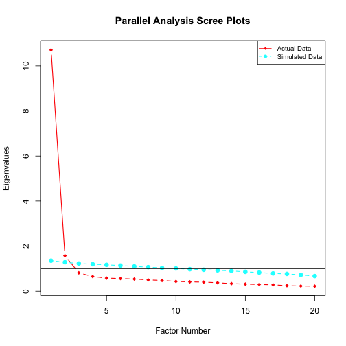

<!-- Run knitr::knit("VEMIRT.Rmd.orig", output = "VEMIRT.Rmd") to prebuild the vignette -->


# Introduction
In this tutorial, we illustrate how to conduct multidimensional item response theory (MIRT) analysis of multidimensional two parameter logistic (M2PL) and multidimensional three parameter logistic (M3PL) models, and differential item functioning (DIF) analysis of M2PL models using the `VEMIRT` package in `R`, which can be installed with

``` r
if (!require(devtools)) install.packages("devtools")
devtools::install_github("MAP-LAB-UW/VEMIRT", build_vignettes = T)
torch::install_torch()
```
The package requires a C++ compiler to work properly, and users are referred to https://github.com/MAP-LAB-UW/VEMIRT for more information.

``` r
library(VEMIRT)
```
Most functions are based on the Gaussian variational expectation-maximization (GVEM) algorithm, which is applicable for high-dimensional latent traits.


# Data Input
Data required for analysis are summarized below:

| Analysis | Item Responses | Loading Indicator | Group Membership |
| :-: | :-: | :-: | :-: |
| Exploratory Factor Analysis | $\checkmark$ |
| Confirmatory Factor Analysis | $\checkmark$ | $\checkmark$ |
| Differential Item Functioning | $\checkmark$ | $\checkmark$ | $\checkmark$ |

Here we take dataset `D2PL_data` as an example. This simulated dataset is for DIF 2PL analysis.
Responses should be an $N$ by $J$ binary matrix, where $N$ and $J$ are the numbers of respondents and items respectively. Currently, DIF functions allow responses to have missing data, which should be coded as `NA`. In this example, there are $N=1500$ respondents and $J=20$ items.

``` r
head(D2PL_data$data)
#>      [,1] [,2] [,3] [,4] [,5] [,6] [,7] [,8] [,9] [,10] [,11] [,12] [,13] [,14] [,15] [,16] [,17] [,18] [,19]
#> [1,]    0    1    0    1    1    0    1    0    0     0     1     0     0     1     0     1     1     1     1
#> [2,]    0    0    0    0    1    0    0    0    0     0     0     0     0     1     0     0     0     0     0
#> [3,]    0    0    0    0    0    0    1    0    0     0     0     0     0     0     0     0     1     0     1
#> [4,]    0    0    1    0    1    0    0    0    0     1     1     1     1     1     1     1     0     1     0
#> [5,]    0    0    0    0    0    0    0    0    0     1     0     0     0     0     0     1     0     0     0
#> [6,]    1    1    1    1    1    0    1    1    1     1     1     1     1     1     1     1     1     1     0
#>      [,20]
#> [1,]     0
#> [2,]     0
#> [3,]     0
#> [4,]     0
#> [5,]     0
#> [6,]     1
```

CFA and DIF rely on a $J$ by $D$ binary loading indicator matrix specifying latent dimensions each item loads on, where $D$ is the number of latent dimensions. The latent traits have $D=2$ dimensions here.

``` r
D2PL_data$model
#>       [,1] [,2]
#>  [1,]    1    0
#>  [2,]    0    1
#>  [3,]    1    0
#>  [4,]    0    1
#>  [5,]    1    0
#>  [6,]    0    1
#>  [7,]    1    0
#>  [8,]    0    1
#>  [9,]    1    0
#> [10,]    0    1
#> [11,]    1    0
#> [12,]    0    1
#> [13,]    1    0
#> [14,]    0    1
#> [15,]    1    0
#> [16,]    0    1
#> [17,]    1    0
#> [18,]    0    1
#> [19,]    1    0
#> [20,]    0    1
```

DIF analysis additionally needs an $N$ dimensional group membership vector, whose elements are integers from $1$ to $G$, where $G$ is the number of groups. There are $G=3$ groups in this example.

``` r
table(D2PL_data$group)
#> 
#>   1   2   3 
#> 500 500 500
```


# Data Output
All the functions output estimates of item parameters and some other related parameters. In addition, `C2PL_gvem` and `C2PL_bs` are able to provide the standard errors of item parameter estimates.


# Exploratory Factor Analysis
## Parallel Analysis
Parallel analysis can be conducted to determine the number of factors. Users can specify the number of simulated datasets, which takes `n.iter = 10` by default.

``` r
pa_poly(D2PL_data$data, n.iter = 5)
#> Parallel analysis suggests that the number of factors =  2
```




## M2PL Model
`VEMIRT` provides the following functions to conduct EFA for the M2PL model:

| Function | Description |
| :-: | :-: |
| `E2PL_gvem_rot` | GVEM with post-doc rotation |
| `E2PL_gvem_lasso` | GVEM with lasso penalty |
| `E2PL_gvem_adaptlasso` | GVEM with adaptive lasso penalty |
| `E2PL_iw` | GVEM with importance sampling |

Currently these functions do not estimate the standard errors of item parameters. The following examples use two simulated datasets, `E2PL_data_C1` and `E2PL_data_C2`, both having $N=1000$ respondents, $J=30$ items and $D=3$ dimensions, but items load on different dimensions.

`E2PL_gvem_rot` needs the item responses and the number of factors (`domain`), and applies the promax rotation (`rot = "Promax"`) by default. Another choice is `rot = "cfQ"`, which performs the CF-Quartimax rotation.

``` r
E2PL_gvem_rot(E2PL_data_C1$data, domain = 3)
#>              a1      a2       a3       b
#> Item1   0.10594  1.5952 -0.10845  1.7290
#> Item2   1.91968  0.0721 -0.05631 -1.3236
#> Item3   0.07972 -0.0394  1.56129 -1.2989
#> Item4   0.19942  1.8727 -0.05273 -0.8808
#> Item5   1.73784  0.0441 -0.11143 -0.8111
#> Item6  -0.05117  0.0230  1.63743  0.1912
#> Item7  -0.05174  1.3707 -0.00506 -0.9726
#> Item8   1.52949  0.1766 -0.03231  0.4670
#> Item9  -0.01529  0.0186  1.42425  1.1823
#> Item10  0.04563  1.4053  0.07149  1.0613
#> Item11  1.64560 -0.0849  0.06168  0.8636
#> Item12  0.08978  0.0130  1.65967 -0.6542
#> Item13  0.10412  1.8613  0.09076  0.0380
#> Item14  1.42716 -0.1292  0.18454  1.5696
#> Item15  0.03152  0.0564  1.78979 -1.3211
#> Item16 -0.03327  1.7001  0.17390 -1.9581
#> Item17  1.84224 -0.0486 -0.00188  0.5343
#> Item18 -0.00405 -0.0918  1.60662  0.5123
#> Item19 -0.19546  1.8230 -0.07211  0.1182
#> Item20  1.34056 -0.0278  0.07707  0.3125
#> Item21  0.14051 -0.0800  1.71112  0.1102
#> Item22 -0.06479  1.9194 -0.02918 -0.6766
#> Item23  1.55836  0.2900  0.05540  1.0387
#> Item24 -0.20321  0.1247  1.59738  0.0535
#> Item25  0.04718  1.4758  0.06536  0.3251
#> Item26  1.75190 -0.0335  0.07172 -0.0327
#> Item27  0.11757  0.0217  1.65739  0.5990
#> Item28  0.00903  1.7688  0.05774 -1.5098
#> Item29  1.65340 -0.0803  0.04002 -1.0095
#> Item30 -0.20175  0.0796  1.52666 -0.1739
```

Both `E2PL_gvem_lasso` and `E2PL_gvem_adaptlasso` need item responses, constraint setting (`constrain`), and a binary matrix specifying constraints on the sub-matrix of the factor loading structure (`indic`). `constrain` should be either `"C1"` or `"C2"` to ensure identifiability. Under `"C1"`, a $D\times D$ sub-matrix of `indic` should be an identity matrix, indicating that each of these $D$ items loads solely on one factor. Notice that the first 3 rows of `E2PL_data_C1$data` form an identity matrix.

``` r
E2PL_data_C1$model
#>       [,1] [,2] [,3]
#>  [1,]    1    0    0
#>  [2,]    0    1    0
#>  [3,]    0    0    1
#>  [4,]    1    1    1
#>  [5,]    1    1    1
#>  [6,]    1    1    1
#>  [7,]    1    1    1
#>  [8,]    1    1    1
#>  [9,]    1    1    1
#> [10,]    1    1    1
#> [11,]    1    1    1
#> [12,]    1    1    1
#> [13,]    1    1    1
#> [14,]    1    1    1
#> [15,]    1    1    1
#> [16,]    1    1    1
#> [17,]    1    1    1
#> [18,]    1    1    1
#> [19,]    1    1    1
#> [20,]    1    1    1
#> [21,]    1    1    1
#> [22,]    1    1    1
#> [23,]    1    1    1
#> [24,]    1    1    1
#> [25,]    1    1    1
#> [26,]    1    1    1
#> [27,]    1    1    1
#> [28,]    1    1    1
#> [29,]    1    1    1
#> [30,]    1    1    1
```
Under `"C2"`, a $D\times D$ sub-matrix of `indic` should be a lower triangular matrix whose diagonal elements are all one, indicating that each of these $D$ items loads on one factor and potentially other factors as well; non-zero elements other than the diagonal are penalized. For identification under `"C2"`, another argument `non_pen` should be provided, which specifies an anchor item that loads on all the factors. In the following example, the first 2 rows and any other row form such a lower triangular matrix, so `non_pen` can take any integer from $3$ to $30$.

``` r
E2PL_data_C2$model
#>       [,1] [,2] [,3]
#>  [1,]    1    0    0
#>  [2,]    1    1    0
#>  [3,]    1    1    1
#>  [4,]    1    1    1
#>  [5,]    1    1    1
#>  [6,]    1    1    1
#>  [7,]    1    1    1
#>  [8,]    1    1    1
#>  [9,]    1    1    1
#> [10,]    1    1    1
#> [11,]    1    1    1
#> [12,]    1    1    1
#> [13,]    1    1    1
#> [14,]    1    1    1
#> [15,]    1    1    1
#> [16,]    1    1    1
#> [17,]    1    1    1
#> [18,]    1    1    1
#> [19,]    1    1    1
#> [20,]    1    1    1
#> [21,]    1    1    1
#> [22,]    1    1    1
#> [23,]    1    1    1
#> [24,]    1    1    1
#> [25,]    1    1    1
#> [26,]    1    1    1
#> [27,]    1    1    1
#> [28,]    1    1    1
#> [29,]    1    1    1
#> [30,]    1    1    1
```
`E2PL_gvem_adaptlasso` needs an additional tuning parameter, which takes `gamma = 2` by default. Users are referred to @cho2024 for algorithmic details.

``` r
result <- with(E2PL_data_C1, E2PL_gvem_lasso(data, model, constrain = "C1"))
result
#>           a1     a2   a3       b
#> Item1  1.572  0.000 0.00  1.7198
#> Item2  0.000  1.923 0.00 -1.3243
#> Item3  0.000  0.000 1.58 -1.2981
#> Item4  1.928  0.000 0.00 -0.8756
#> Item5  0.000  1.696 0.00 -0.8114
#> Item6  0.000  0.000 1.62  0.1907
#> Item7  1.337  0.000 0.00 -0.9712
#> Item8  0.000  1.589 0.00  0.4653
#> Item9  0.000  0.000 1.42  1.1816
#> Item10 1.473  0.000 0.00  1.0629
#> Item11 0.000  1.639 0.00  0.8623
#> Item12 0.000  0.000 1.71 -0.6524
#> Item13 1.964  0.000 0.00  0.0408
#> Item14 0.000  1.459 0.00  1.5628
#> Item15 0.000  0.000 1.84 -1.3199
#> Item16 1.776  0.000 0.00 -1.9514
#> Item17 0.000  1.807 0.00  0.5304
#> Item18 0.000  0.000 1.55  0.5113
#> Item19 1.812 -0.277 0.00  0.1169
#> Item20 0.000  1.367 0.00  0.3120
#> Item21 0.000  0.000 1.73  0.1104
#> Item22 1.861  0.000 0.00 -0.6754
#> Item23 0.322  1.560 0.00  1.0364
#> Item24 0.000  0.000 1.54  0.0525
#> Item25 1.544  0.000 0.00  0.3269
#> Item26 0.000  1.775 0.00 -0.0335
#> Item27 0.000  0.000 1.74  0.6011
#> Item28 1.803  0.000 0.00 -1.5078
#> Item29 0.000  1.633 0.00 -1.0087
#> Item30 0.000 -0.204 1.57 -0.1730
with(E2PL_data_C2, E2PL_gvem_adaptlasso(data, model, constrain = "C2", non_pen = 3))
#>             a1    a2   a3       b
#> Item1   1.6019 0.000 0.00  1.7409
#> Item2   0.4230 2.419 0.00 -1.1530
#> Item3   0.0000 2.649 1.00 -1.2417
#> Item4   1.9203 0.000 0.00 -0.8737
#> Item5  -1.2687 2.575 0.00 -0.8181
#> Item6  -0.1981 0.988 1.30  0.1904
#> Item7   1.3404 0.000 0.00 -0.9736
#> Item8  -0.8955 2.214 0.00  0.4638
#> Item9  -0.2045 0.908 1.12  1.1810
#> Item10  1.5077 0.000 0.00  1.0795
#> Item11 -1.2717 2.493 0.00  0.8623
#> Item12 -0.3468 1.248 1.32 -0.6612
#> Item13  2.0240 0.000 0.00  0.0465
#> Item14 -1.1050 2.213 0.00  1.5660
#> Item15 -0.2273 1.163 1.39 -1.3111
#> Item16  1.8359 0.000 0.00 -1.9954
#> Item17 -1.3386 2.723 0.00  0.5314
#> Item18 -0.3741 1.035 1.27  0.5081
#> Item19  1.6743 0.000 0.00  0.1161
#> Item20 -0.9951 2.069 0.00  0.3137
#> Item21 -0.4841 1.330 1.34  0.1086
#> Item22  1.8836 0.000 0.00 -0.6795
#> Item23 -0.7954 2.335 0.00  1.0436
#> Item24  0.0000 0.731 1.26  0.0521
#> Item25  1.5476 0.000 0.00  0.3304
#> Item26 -1.2496 2.608 0.00 -0.0336
#> Item27 -0.3240 1.230 1.30  0.5954
#> Item28  1.8113 0.000 0.00 -1.5157
#> Item29 -1.2838 2.500 0.00 -1.0119
#> Item30 -0.0444 0.701 1.23 -0.1758
```

GVEM is known to produce biased estimates for discrimination parameters, and `E2PL_iw` helps reduce the bias through importance sampling [@ma2024].

``` r
E2PL_iw(E2PL_data_C1$data, result)
#>          a1     a2   a3        b
#> Item1  1.82  0.000 0.00  1.93892
#> Item2  0.00  2.176 0.00 -1.51429
#> Item3  0.00  0.000 1.83 -1.50028
#> Item4  2.18  0.000 0.00 -1.06272
#> Item5  0.00  1.943 0.00 -0.95791
#> Item6  0.00  0.000 1.86  0.24090
#> Item7  1.57  0.000 0.00 -1.15989
#> Item8  0.00  1.834 0.00  0.61006
#> Item9  0.00  0.000 1.66  1.38268
#> Item10 1.71  0.000 0.00  1.25149
#> Item11 0.00  1.885 0.00  1.04897
#> Item12 0.00  0.000 1.96 -0.79208
#> Item13 2.21  0.000 0.00 -0.00846
#> Item14 0.00  1.697 0.00  1.78234
#> Item15 0.00  0.000 2.09 -1.51844
#> Item16 2.03  0.000 0.00 -2.17690
#> Item17 0.00  2.057 0.00  0.68606
#> Item18 0.00  0.000 1.80  0.64290
#> Item19 2.05 -0.162 0.00  0.10766
#> Item20 0.00  1.598 0.00  0.42147
#> Item21 0.00  0.000 1.97  0.13218
#> Item22 2.11  0.000 0.00 -0.84737
#> Item23 0.49  1.805 0.00  1.24074
#> Item24 0.00  0.000 1.78  0.05249
#> Item25 1.78  0.000 0.00  0.37440
#> Item26 0.00  2.022 0.00  0.00687
#> Item27 0.00  0.000 1.99  0.74305
#> Item28 2.05  0.000 0.00 -1.72294
#> Item29 0.00  1.880 0.00 -1.18368
#> Item30 0.00 -0.105 1.81 -0.20663
```


## M3PL Model
`VEMIRT` provides the following functions to conduct EFA for the M3PL model:

| Function | Description |
| :-: | :-: |
| `E3PL_sgvem_rot` | Stochastic GVEM with post-doc rotation |
| `E3PL_sgvem_lasso` | Stochastic GVEM with lasso penalty |
| `E3PL_sgvem_adaptlasso` | Stochastic GVEM with adaptive lasso penalty |

The following examples use two simulated datasets, `E3PL_data_C1` and `E3PL_data_C2`, both having $N=1000$ respondents, $J=30$ items and $D=3$ dimensions, but items load on different dimensions.

The usage of these functions is similar to those for M2PL models, but some additional arguments are required: the size of the subsample for each iteration (`samp = 50` by default), the forget rate for the stochastic algorithm (`forgetrate = 0.51` by default), the mean and the variance of the normal distribution as a prior for item difficulty parameters (`mu_b` and `sigma2_b`), the $\alpha$ and $\beta$ parameters of the beta distribution as a prior for guessing parameters (`Alpha` and `Beta`). Still, `E3PL_sgvem_adaptlasso` needs a tuning parameter, which takes `gamma = 2` by default. Users are referred to @cho2024 for algorithmic details. In the following examples, the priors for difficulty parameters and guessing parameters are $N(0,2^2)$ and $\beta(10,40)$ respectively.

``` r
with(E3PL_data_C1, E3PL_sgvem_adaptlasso(data, model, mu_b = 0, sigma2_b = 4, Alpha = 10, Beta = 40, constrain = "C1"))
#> Warning: The maximum number of EM cycles reached!
#> Warning: The maximum number of EM cycles reached!
#>           a1   a2    a3       b     c
#> Item1  0.824 0.00 0.000  0.2221 0.185
#> Item2  0.000 1.27 0.000 -1.1569 0.188
#> Item3  0.000 0.00 1.531 -1.2687 0.187
#> Item4  1.884 0.00 0.000 -0.6809 0.181
#> Item5  0.000 1.39 0.000 -0.9603 0.188
#> Item6  0.000 0.00 1.531  0.0323 0.179
#> Item7  1.576 0.00 0.000 -0.9503 0.184
#> Item8  0.000 1.15 0.000  0.2288 0.184
#> Item9  0.000 0.00 0.981  0.7210 0.178
#> Item10 1.244 0.00 0.000  0.6862 0.176
#> Item11 0.000 1.32 0.000  0.8267 0.174
#> Item12 0.000 0.00 1.302 -0.8383 0.187
#> Item13 1.937 0.00 0.000  0.5078 0.162
#> Item14 0.000 1.01 0.000  1.0492 0.176
#> Item15 0.000 0.00 1.419 -1.1223 0.187
#> Item16 1.564 0.00 0.000 -1.5017 0.187
#> Item17 0.000 1.47 0.000  0.2434 0.178
#> Item18 0.000 0.00 1.151  0.4002 0.179
#> Item19 1.578 0.00 0.000 -0.1455 0.178
#> Item20 0.000 1.12 0.000  0.2213 0.184
#> Item21 0.000 0.00 1.577  0.0950 0.174
#> Item22 1.866 0.00 0.000 -0.4013 0.177
#> Item23 0.000 1.23 0.000  0.9747 0.179
#> Item24 0.000 0.00 1.189 -0.5513 0.186
#> Item25 1.503 0.00 0.000  0.2557 0.177
#> Item26 0.000 1.30 0.000  0.2660 0.183
#> Item27 0.000 0.00 1.217  0.0448 0.182
#> Item28 1.498 0.00 0.000 -1.1697 0.187
#> Item29 0.000 1.20 0.000 -0.8706 0.187
#> Item30 0.000 0.00 1.244 -0.2850 0.184
with(E3PL_data_C2, E3PL_sgvem_lasso(data, model, mu_b = 0, sigma2_b = 4, Alpha = 10, Beta = 40, constrain = "C2", non_pen = 3))
#>           a1     a2    a3       b     c
#> Item1  0.716 0.0000 0.000  0.1848 0.184
#> Item2  0.000 1.6328 0.000 -1.2424 0.184
#> Item3  0.000 0.0000 1.737 -1.0087 0.179
#> Item4  1.336 0.5179 0.000 -0.7203 0.182
#> Item5  0.000 1.4377 0.000 -0.9989 0.185
#> Item6  0.000 0.0000 1.288  0.0595 0.180
#> Item7  1.113 0.4590 0.000 -0.9681 0.184
#> Item8  0.000 1.2972 0.000  0.1770 0.179
#> Item9  0.000 0.0000 0.896  0.7047 0.178
#> Item10 0.931 0.2317 0.000  0.6889 0.176
#> Item11 0.000 1.4404 0.000  0.7989 0.168
#> Item12 0.000 0.0000 1.203 -0.8368 0.186
#> Item13 1.377 0.5979 0.000  0.5104 0.163
#> Item14 0.000 0.9938 0.000  1.0340 0.172
#> Item15 0.000 0.0000 1.283 -1.1360 0.187
#> Item16 1.057 0.5547 0.000 -1.5126 0.187
#> Item17 0.000 1.5168 0.000  0.1848 0.172
#> Item18 0.000 0.1215 0.954  0.4423 0.178
#> Item19 1.096 0.4350 0.000 -0.1511 0.179
#> Item20 0.000 1.1924 0.000  0.2106 0.180
#> Item21 0.000 0.0000 1.329  0.1301 0.174
#> Item22 1.336 0.4624 0.000 -0.3802 0.177
#> Item23 0.000 1.2371 0.000  0.9373 0.173
#> Item24 0.000 0.0000 1.057 -0.5256 0.186
#> Item25 1.155 0.2704 0.000  0.2513 0.175
#> Item26 0.000 1.3993 0.000  0.2171 0.176
#> Item27 0.000 0.0558 1.073  0.0427 0.183
#> Item28 1.182 0.2371 0.000 -1.2105 0.186
#> Item29 0.000 1.2586 0.000 -0.9502 0.185
#> Item30 0.000 0.0000 1.040 -0.2977 0.185
```


# Confirmatory Factor Analysis
## M2PL Model
`VEMIRT` provides the following functions to conduct CFA for the M2PL model:

| Function | Description |
| :-: | :-: |
| `C2PL_gvem` | GVEM |
| `C2PL_bs` | GVEM with bootstrap |
| `C2PL_iw` | GVEM with importance sampling |

A binary loading indicator matrix needs to be provided for CFA. `C2PL_gvem` can produce biased estimates while the other two functions help reduce the bias. Also, only `C2PL_gvem` and `C2PL_bs` are able to provide the standard errors of item parameters. Users are referred to @cho2021 for `C2PL_gvem` and @ma2024 for `C2PL_iw`.

The following examples use a simulated dataset, `C2PL_data`, which has $N=1000$ respondents, $J=20$ items and $D=2$ dimensions.

``` r
result <- with(C2PL_data, C2PL_gvem(data, model))
result
#>          a1   a2       b
#> Item1  1.91 0.00  0.8789
#> Item2  0.00 1.71 -2.1325
#> Item3  1.85 0.00  0.4760
#> Item4  0.00 2.03 -1.2061
#> Item5  1.89 0.00 -0.6088
#> Item6  0.00 1.57  1.1850
#> Item7  1.46 0.00 -1.8576
#> Item8  0.00 1.79 -0.3041
#> Item9  1.40 0.00  0.3218
#> Item10 0.00 1.49 -0.4536
#> Item11 1.89 0.00 -0.3825
#> Item12 0.00 1.71 -0.1322
#> Item13 1.36 0.00  0.5896
#> Item14 0.00 1.43 -2.1947
#> Item15 1.80 0.00  0.0357
#> Item16 0.00 1.51  0.9673
#> Item17 1.97 0.00  0.1262
#> Item18 0.00 1.68  0.5347
#> Item19 1.81 0.00 -0.7190
#> Item20 0.00 1.62 -1.4178
C2PL_bs(result)
#>          a1   a2       b
#> Item1  2.19 0.00  0.9542
#> Item2  0.00 2.05 -2.3435
#> Item3  2.09 0.00  0.5665
#> Item4  0.00 2.38 -1.3555
#> Item5  2.22 0.00 -0.6731
#> Item6  0.00 1.66  1.2325
#> Item7  1.62 0.00 -1.9500
#> Item8  0.00 2.00 -0.3105
#> Item9  1.51 0.00  0.3396
#> Item10 0.00 1.63 -0.4173
#> Item11 2.21 0.00 -0.4012
#> Item12 0.00 1.86 -0.1082
#> Item13 1.43 0.00  0.5435
#> Item14 0.00 1.52 -2.3258
#> Item15 2.07 0.00  0.0380
#> Item16 0.00 1.64  1.0678
#> Item17 2.33 0.00  0.0801
#> Item18 0.00 1.88  0.5184
#> Item19 2.09 0.00 -0.8113
#> Item20 0.00 1.79 -1.4681
C2PL_iw(C2PL_data$data, result)
#>          a1   a2       b
#> Item1  2.16 0.00  1.0352
#> Item2  0.00 1.96 -2.3604
#> Item3  2.09 0.00  0.5737
#> Item4  0.00 2.28 -1.4103
#> Item5  2.14 0.00 -0.7289
#> Item6  0.00 1.80  1.3748
#> Item7  1.70 0.00 -2.0733
#> Item8  0.00 2.03 -0.4369
#> Item9  1.63 0.00  0.3934
#> Item10 0.00 1.72 -0.5925
#> Item11 2.14 0.00 -0.4616
#> Item12 0.00 1.95 -0.2265
#> Item13 1.58 0.00  0.7169
#> Item14 0.00 1.67 -2.4219
#> Item15 2.05 0.00  0.0132
#> Item16 0.00 1.74  1.1379
#> Item17 2.22 0.00  0.1296
#> Item18 0.00 1.92  0.6167
#> Item19 2.06 0.00 -0.8566
#> Item20 0.00 1.86 -1.6292
```

## M3PL Model
`C3PL_sgvem` conducts CFA for M3PL models. Its usage is similar to that of `E3PL_sgvem_*` except that a binary loading indicator matrix is needed additionally. Users are referred to @cho2021 for algorithmic details.

The following example uses a simulated dataset, `C3PL_data`, which has $N=2000$ respondents, $J=20$ items and $D=2$ dimensions. The priors for difficulty parameters and guessing parameters are chosen to be $N(0,2^2)$ and $\beta(10,40)$ respectively.

``` r
with(C3PL_data, C3PL_sgvem(data, model, mu_b = 0, sigma2_b = 4, Alpha = 10, Beta = 40))
#>          a1    a2       b     c
#> Item1  1.16 0.000 -0.1003 0.185
#> Item2  0.00 1.433  1.5776 0.152
#> Item3  1.80 0.000 -0.5373 0.179
#> Item4  0.00 1.557 -1.4996 0.187
#> Item5  1.46 0.000 -1.6942 0.188
#> Item6  0.00 1.409  1.6327 0.155
#> Item7  1.29 0.000 -0.6398 0.185
#> Item8  0.00 1.395  0.0948 0.179
#> Item9  1.70 0.000  0.6206 0.170
#> Item10 0.00 1.430 -0.0898 0.181
#> Item11 1.22 0.000  0.5128 0.175
#> Item12 0.00 0.955  1.3418 0.173
#> Item13 1.46 0.000  1.4928 0.159
#> Item14 0.00 1.202  0.8414 0.175
#> Item15 1.24 0.000 -0.0937 0.183
#> Item16 0.00 1.511  0.6968 0.168
#> Item17 1.43 0.000 -0.4500 0.182
#> Item18 0.00 1.758 -1.2304 0.182
#> Item19 1.01 0.000  1.0262 0.175
#> Item20 0.00 1.139 -0.7983 0.188
```


# Differential Item Functioning
`VEMIRT` provides the following functions to detect DIF for the M2PL model:

| Function | Description |
| :-: | :-: |
| `D2PL_lrt` | Likelihood Ratio Test |
| `D2PL_em` | EM with lasso penalty |
| `D2PL_gvem` | GVEM with lasso penalty |

We recommend `D2PL_em` for low-dimensional cases (e.g., $D\leq 3$) because it is more accurate; `D2PL_gvem` is recommend for high-dimensional cases and/or fast estimation. Both functions require item responses, loading indicator, and group membership. Besides, estimation method (`method`) and tuning parameter vector (`Lambda0`) are the two most important arguments. `IWGVEMM` is the default choice and is recommended for `D2PL_gvem` because this method has an additional importance sampling step which helps improve accuracy. We do not recommend `D2PL_lrt` because it is time-consuming. Users are referred to @wang2023 for `D2PL_em`.

``` r
result <- with(D2PL_data, D2PL_gvem(data, model, group, method = 'IWGVEMM', Lambda0 = seq(0.2, 0.7, by = 0.1), verbose = F))
result
#>      1 2 3 4 5 6 7 8 9 10 11 12 13 14 15 16 17 18 19 20
#> 2:a1                                                   
#> 2:a2                                                   
#> 2:b          X                                         
#> 3:a1                                                   
#> 3:a2       X                                           
#> 3:b  X X X X X X                                       
#> * lambda0 = 0.5
```
Item parameters are ordered by groups and group 1 is the reference group. DIF items are flagged by `X`. By default, `D2PL_gvem` chooses the best tuning parameter using the generalized information criterion (GIC), and in this example 0.5 is chosen, but AIC and BIC can be used too.

``` r
print(result, 'AIC')
#> Warning in check.vemirt_DIF(all, fit, "lambda0"): Optimal lambda0 may be less than 0.2.
#>      1 2 3 4 5 6 7 8 9 10 11 12 13 14 15 16 17 18 19 20
#> 2:a1                                                   
#> 2:a2                                                   
#> 2:b  X X   X X   X   X  X              X  X     X      
#> 3:a1 X   X   X       X                                 
#> 3:a2   X   X   X                                       
#> 3:b  X X X X X X   X X                          X      
#> * lambda0 = 0.2
```
The message warns us that the optimal tuning parameter may be out of the range specified for estimation. Users should specify a wider range for the argument `Lambda0` if the current information criterion is used. Finally, other parameter estimates can be obtained too:

``` r
str(coef(result, 'BIC'))
#> List of 17
#>  $ lambda0: num 0.4
#>  $ lambda : num 15.5
#>  $ niter  : num [1:2] 108 100
#>  $ ll     : num -11577
#>  $ l0     : int 12
#>  $ SIGMA  : num [1:1500, 1:2, 1:2] 0.103 0.124 0.116 0.103 0.13 ...
#>  $ MU     : num [1:1500, 1:2] 0.00366 -1.21956 -0.86532 0.05182 -1.44339 ...
#>  $ Sigma  : num [1:3, 1:2, 1:2] 1 0.979 1.007 0.834 0.814 ...
#>  $ Mu     : num [1:3, 1:2] 0 -0.0152 0.0842 0 -0.1347 ...
#>  $ a      : num [1:20, 1:2] 2.31 0 2.13 0 1.95 ...
#>  $ b      : num [1:20] 1.0515 0.6607 0.0834 0.82 -0.1187 ...
#>  $ gamma  : num [1:3, 1:20, 1:2] 0 0 0 0 0 0 0 0 0 0 ...
#>  $ beta   : num [1:3, 1:20] 0 0 0.862 0 0.659 ...
#>  $ RMSE   : num 0.015
#>  $ AIC    : num 23177
#>  $ BIC    : num 23241
#>  $ GIC    : num 23328
```


# Package Evaluation
Here we show two examples on how to test the `VEMIRT` package by simulating data, estimating the model using `VEMIRT`, and then checking accuracy.

``` r
library(abind)
library(mvtnorm)
set.seed(1)
```

## Confirmatory 2PL Model

``` r
Sigma <- matrix(c(1, 0.85, 0.85, 1), 2)
J <- 10
N <- 1000
model <- cbind(rep(1:0, J / 2), rep(0:1, J / 2))
a <- matrix(runif(J * 2, 1, 3), ncol = 2) * model
b <- rnorm(J)
theta <- rmvnorm(N, rep(0, 2), Sigma)
data <- t(matrix(rbinom(N * J, 1, plogis(a %*% t(theta) - b)), nrow = J))

result.gvem <- C2PL_gvem(data, model)
result.iw <- C2PL_iw(data, result.gvem)

rmse <- function(x, y) {
  sqrt(mean((x - y) ^ 2))
}
c(a = rmse(a[model == 1], coef(result.gvem)[, 1:2][model == 1]), b = rmse(b, coef(result.gvem)$b))
#>         a         b 
#> 0.6039514 0.1318309
c(a = rmse(a[model == 1], coef(result.iw)[, 1:2][model == 1]), b = rmse(b, coef(result.iw)$b))
#>          a          b 
#> 0.40411993 0.09705373
```


## DIF 2PL Model

``` r
Sigma <- matrix(c(1, 0.85, 0.85, 1), 2)
J <- 10
j <- J * 0.4
n <- 500
group <- rep(1:3, each = n)
model <- cbind(rep(1:0, J / 2), rep(0:1, J / 2))
a <- matrix(runif(J * 2, 1, 3), ncol = 2) * model
a <- unname(abind(a, a, a, along = 0))
a[-1, 1:(j / 2), ] <- a[-1, 1:(j / 2), ] + c(0.5, 0.9)
a[-1, (j / 2 + 1):j, ] <- a[-1, (j / 2 + 1):j, ] - c(0.5, 0.9)
a[-1, , ] <- a[-1, , ] * abind(model, model, along = 0)
b <- rnorm(J)
b <- unname(rbind(b, b, b))
b[-1, 1:(j / 2)] <- b[-1, 1:(j / 2)] - c(0.3, 0.8)
b[-1, (j / 2 + 1):j] <- b[-1, (j / 2 + 1):j] + c(0.3, 0.8)
theta <- rmvnorm(n * 3, rep(0, 2), Sigma)
data <- t(sapply(1:(n * 3), function(n) {
  rbinom(J, 1, plogis(a[group[n], , ] %*% theta[n, ] - b[group[n], ]))
}))

result.iw <- D2PL_gvem(data, model, group, verbose = F)
result.iw.gic <- summary(result.iw, 1)
result.iw.bic <- summary(result.iw, 'BIC')

count <- function(j, result) {
  pos <- colSums(result) > 0
  c(`True Positive` = mean(pos[1:j]), `False Positive` = mean(pos[-(1:j)]))
}
count(j, coef(result.iw.gic))
#>  True Positive False Positive 
#>           0.75           0.00
count(j, coef(result.iw.bic))
#>  True Positive False Positive 
#>      1.0000000      0.1666667
```


# References
<div id = "refs"></div>
